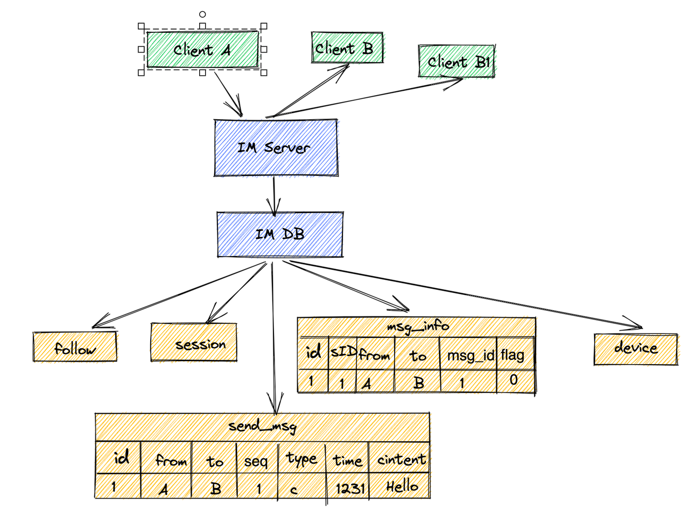

# 需求分析：

## 功能
我们要实现一个 IM 系统的话，我们需要完成 大概以下的这些功能
* 添加好有
* 聊天会话列表
* 单聊
* 群聊
* 多设备登录
* 消息漫游，我这台手机发的消息，另外一台手机一样可以看到
* 消息 已读 撤回 查看已读列表，未读列表等

## 约束
    我们这个项目的话，希望可以达到哪些要求
* DAU
* 可靠性 要求 5 个 9
* 收发消息延时
* 消息时序一致性 （ 发送与接收消息顺序一直，不重复不遗漏 ）
* 千人群聊
* 可运维性

## 可行解
